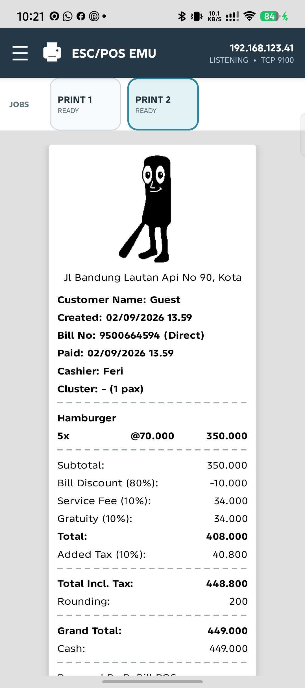
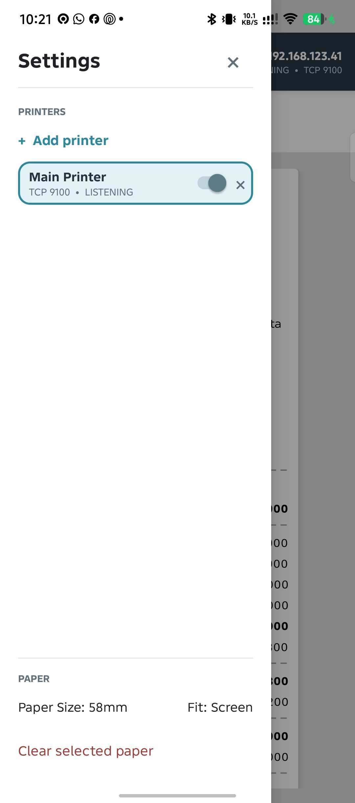

# ESC/POS Thermal Printer Emulator

> A virtual thermal printer for POS development.
>
> Send ESC/POS bytes over TCP and inspect the receipt on screen.

Native Android emulator for POS apps and other ESC/POS clients. It behaves like a network printer, decodes receipt commands, and renders each print job as a selectable paper preview directly on an Android device.

## Overview

The emulator displays receipt layouts, formatting, and raster images without requiring a physical printer or paper.

## Features

| Capability | Behavior |
| --- | --- |
| Multi-printer lab | Add, remove, enable, and select multiple named TCP printer profiles |
| Network printer | Each enabled profile listens on its own TCP port across all local interfaces |
| Text | UTF-8, monospace, and line feeds |
| Formatting | Left, center, right alignment, and bold text |
| Raster images | Decodes `GS v 0`, `GS ( L`, and `ESC *` into real Android bitmaps |
| Cut commands | Renders `GS V` and `ESC i` as labeled auto-cut dividers |
| Paper widths | 384px 58mm and 576px 80mm logical paper previews |
| Print jobs | Select `PRINT 1`, `PRINT 2`, and later jobs from the print strip |
| Responsive preview | Fit 58mm/80mm paper to the device screen or inspect it at 100% scale |
| Developer workflow | Persistent profiles, clear selected jobs, and auto-scroll |

No AppCompat. No Compose. No networking library. The runtime uses Kotlin, XML, and standard Android SDK APIs only.

## Preview

<p align="center">
  
  &nbsp;
  
</p>

## Quick start

### Requirements

- Android Studio or JDK 17
- Android SDK 36
- Android device or emulator on the same network as the POS app

If Gradle reports `SDK location not found`, configure the SDK path for your machine. On this Mac:

```bash
echo "sdk.dir=$HOME/Library/Android/sdk" > local.properties
```

Alternatively, set `ANDROID_HOME` or open the project in Android Studio and let it configure the SDK location. `local.properties` is intentionally ignored by Git because the path is machine-specific.

### Build and install

You can download the prebuilt APK (`escpos-emu-android-v1.0.0.apk`) from [Releases](https://github.com/axelmalik/escpos-emu-android/releases/latest), or build and install from source:

```bash
./gradlew :app:assembleRelease
adb install -r app/build/outputs/apk/release/escpos-emu-android-v1.0.0.apk
```

Open **ESC/POS EMU** and note the large device address shown in the header, for example:

```text
192.168.1.50
LISTENING  •  TCP 9100
```

Configure your POS app's TCP/LAN printer destination with that IP and the selected printer profile's port, then print normally. Use **Add Printer** when you need to emulate multiple destinations at the same time.

## Try it without a POS app

Replace the IP address below with the address shown in the emulator:

```bash
python3 - <<'PY'
import socket

printer = ("192.168.1.50", 9100)
receipt = b"\x1b@"
receipt += b"\x1ba\x01ESC/POS EMULATOR\n"
receipt += b"\x1ba\x00"
receipt += b"Coffee                 25,000\n"
receipt += b"Cake                   35,000\n"
receipt += b"\x1bE\x01TOTAL                60,000\x1bE\x00\n"
receipt += b"\n"
receipt += b"\x1dv\x30\x00"
receipt += b"\x01\x00\x01\x00\x80"
receipt += b"\x1dv\x00"

with socket.create_connection(printer, timeout=5) as connection:
    connection.sendall(receipt)
PY
```

## Supported ESC/POS commands

| Command | Supported behavior |
| --- | --- |
| `ESC a n` | `0`/`48` left, `1`/`49` center, `2`/`50` right |
| `ESC E n` | `0` normal, nonzero bold |
| `LF` | Adds a receipt line break |
| `GS v 0 m xL xH yL yH ...` | MSB-first raster decoding; modes `0`–`3` support normal/double width/height |
| `GS ( L` | Graphics raster image data used by common ESC/POS libraries |
| `ESC *` | Column-format image data used by common ESC/POS libraries |
| `GS V m [n]` | Adds a paper cut divider |
| `ESC i` | Adds a paper cut divider |

Unknown control bytes are ignored, preventing binary printer traffic from appearing as garbled text.

## Compatibility & Hardware Benchmarks

The emulator's layout, character wrapping, line spacing, and raster decoding have been tested with real-world POS generators and verified against physical thermal printers:

- **Client Libraries**: Tested with popular ESC/POS builders including Flutter's [`esc_pos_utils`](https://pub.dev/packages/esc_pos_utils) / [`flutter_esc_pos_utils`](https://pub.dev/packages/flutter_esc_pos_utils), Node.js `escpos`, Python `python-escpos`, and raw TCP byte streams.
- **Hardware Benchmarks**: Print layout fidelity (column alignments, margins, auto-cut dividers, and bitmap rendering) was compared and tuned against:
  - **Epson TM-T82** (standard 80mm thermal receipt printer)
  - **Bluetooth Thermal Printer EPS-80M / EPS8M** (portable 58mm/80mm thermal printer)

## Controls

- **Clear Paper** removes the selected printer's print-job history.
- **Add Printer** creates another named TCP listener. Ports must be unique.
- Select a printer card to view its receipt. The switch enables or disables its listener.
- Select a print card to switch between completed print jobs.
- **Paper Size: 58mm / 80mm** changes the selected receipt's logical width.
- **Fit: Screen / Scale: 100%** controls paper reduction for the device display.
- Printer profiles and enabled states persist across app restarts.

## Architecture

```text
POS apps
   │ raw ESC/POS bytes
   ▼
One ServerSocket per enabled profile
   │ arbitrary TCP chunks
   ▼
EscPosParser per client
   │ typed text / image / cut events
   ▼
Selected profile's paper preview
```

The parser is incremental, so command headers and raster payloads can span multiple socket reads. Raster dimensions are bounded before allocation, and binary image bytes are never sent through the text renderer.

## Project map

```text
app/src/main/java/com/axelmalik/escposemuandroid/
├── MainActivity.kt
├── PaperViewport.kt
├── PrintJob.kt
├── PrinterProfile.kt
└── EscPosParser.kt

app/src/main/res/layout/activity_main.xml
app/src/main/java/com/axelmalik/escposemuandroid/PrinterLogoView.kt
app/src/test/.../EscPosParserTest.kt
app/src/test/.../PrinterProfileTest.kt
```

## Development

Run parser tests with:

```bash
./gradlew :app:testDebugUnitTest
```

The listener is activity-scoped and remains active while the emulator screen is open. Android may stop an activity-owned process when the app is backgrounded or reclaimed.

## Troubleshooting

**The POS app cannot connect**

- Confirm both devices are on the same Wi-Fi network.
- Use the emulator's LAN IP, not `127.0.0.1`.
- Confirm the POS app is sending raw ESC/POS over TCP, not HTTP.
- Check that port `9100` is not already in use.

**The header shows `0.0.0.0`**

Connect the Android device to Wi-Fi, reopen the app, and check the header again.

## License

This project is licensed under the [MIT License](LICENSE).
